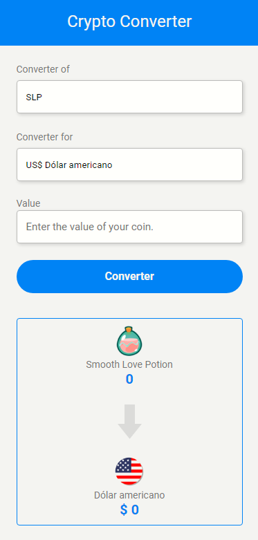

# Crypto Conversor

> This project was developed to be responsive to all screens and above an image of the final result of the project.

### Adjustments and improvements

The project is still under development and future updates will focus on the following tasks:

- [x] HTML
- [x] CSS
- [X] JS
- [ ] Add animation to the project.
- [ ] Add other cryptos.
- [ ] Get the value of all cryptocurrencies in real time.

## To view

> if you want to view the project in your browser use this link from github itself.

https://luanrebuli.github.io/CryptoConversor/

## Contributors

We thank the following people who contributed to this project:

<table>
  <tr>
    <td align="center">
      <a href="#">
         
        
          <b>Luan Rebuli</b>
        
      </a>
    </td>
  </tr>
</table>

